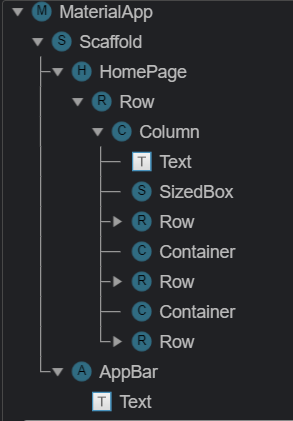
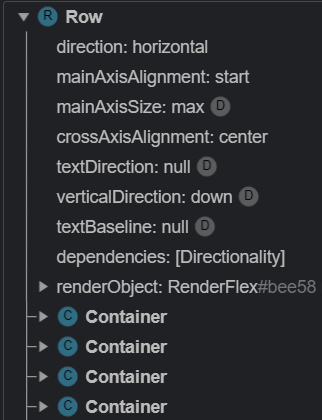
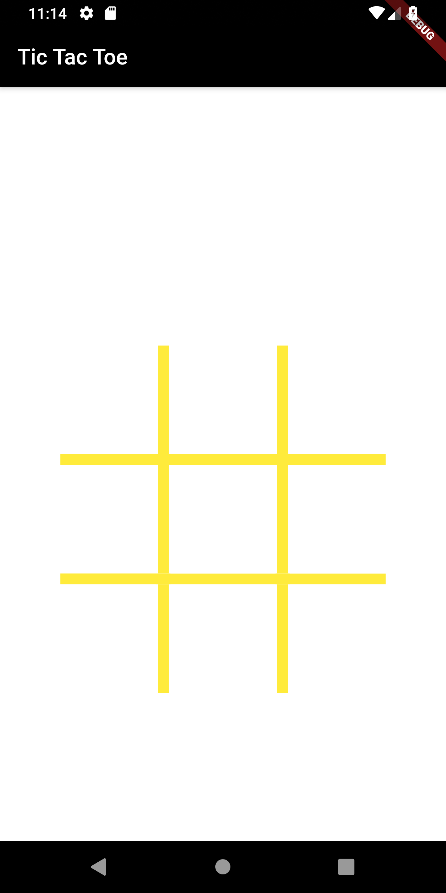
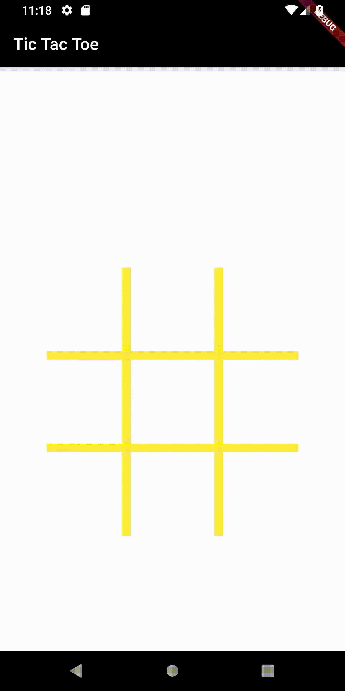

# tic_tac_toe

It’s a simple Tic Tac Toe application which requires two players to play the game, It has an auto reset feature which auto resets the game after one of the player wins.

## How it was built:

1. Building the grid structure:

    I've used a nested column-row layout to build the grid. Containers are used between each row as seperators.
    
    
    
    Each row contains containers, which act as both placeholders and seperators.
    The placeholders contain a flat-button which will perform a function on press
    
    
    
    This is how it might look:
    
    
    
2. Adding all the assets needed

    Add all the images (circle, cross, etc) that are needed in the project . Open `pubspec.yaml` file inside your project folder, and           the assets:
    
      ```
      # To add assets to your application, add an assets section, like this:
      assets:
        - images/
      ```
      This will link all the images in your iamges folder as an asset
      
3. Initialize and Reset

    Initializing all the variables
    
    i. `var gameState` , is a list that stores the current state of the game i.e. wether a element is `empty` , `X` or `O`
    
    ii. `var color1`  , is a list that stores the backgroung color of each cell, it is used to change the color when the game ends
    
    iii. `i` to toggle turns between the two players
    
    iv.  `result` to store the final result of the game
    
    `reset()` resets the game, all the variables to initial values
    
4. Changing State to Cross or Circle upon user click

    To implement this functionality we have implemented a function called `xox()`. This function takes the user click as an index number and checks whether the element of the specific index in `gameState(lists of String created earlier)` is either empty or not.

To set the state to a cross or a circle alternately upon user click we need to incriment `i` value will keep on switching between `Even` and `Odd` upon user click.

5. Game Logic

Surprisingly the logic behind this game is actually very simple, and all you have to do is check consecutive indexes and that’s it.

As we’ve already created our list with 9 elements where there are 3 elements in each row, what we actually have to check is whether the 1st element is equal to the 2nd one and whether or not the 2nd element is equal to the next consecutive element, if your answer is true for both the cases! Viola, you’ve got the winner.

Similarly, you should not just check for horizontal elements but also for vertically downward elements and diagonals as well

`checkWin()` checks wether the game is won or not, it changes the colour of the cell based on the result.

`winner()` checks who won the game `X `or `O` and declares the result and the calls the `reset()` function after a delay.

* # Final App
  * Win
  
  
  
  * Draw
  
  

